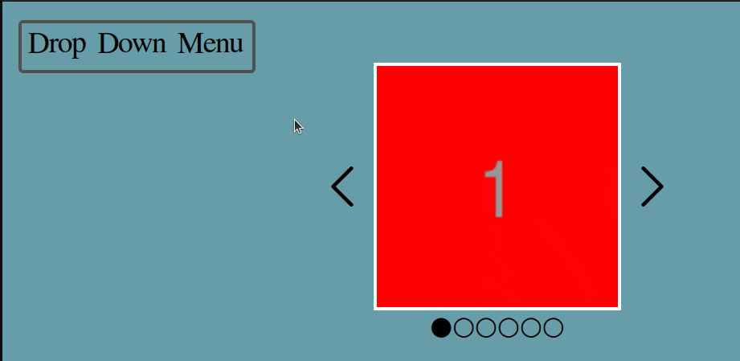

# slider
Interactive menu with a simple image carousel.

### Features: 
- Drop-down menu with two menu layers;
- Simple animated image carousel with automatic slide.
 
### Technical notes about project development:
This is my first attempt on drop-down menus and carousel logic. 
The slider was made using the `.children` array of the element that holds all the images and their rendering happens by changing the `display` property from `none` to `block` if the left/right arrows are pressed. 
The automatic sliding was made using a nested `setTimeout` that activate the change display function key every 3s.
The dropdown menu was somewhat experimental, I mainly used event listeners, like `mouseover/out`, to determine how the elements would be displayed, still needs alot of refinement.

